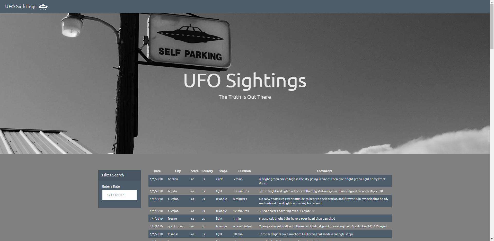
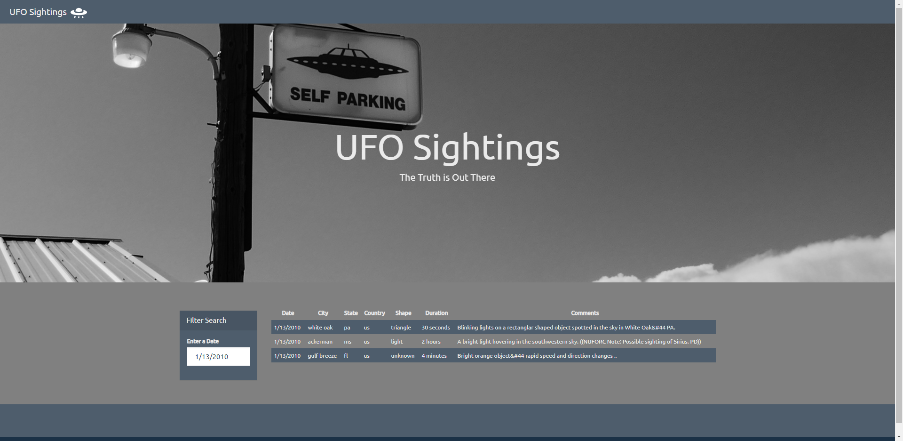

# JavaScript and DOM Manipulation

### Rice University Data Analytics and Visualization Boot Camp 2020

This repository contains code that will create a table dynamically based upon a [dataset provide](UFO-level-1/static/js/data.js). The code allows the users to filter the table data for specific values. We only use pure JavaScript, HTML, and CSS, and D3.js on our web pages. 
 

### Level 1: Automatic Table and Date Search | **UFO-level-1**

* Create a HTML [web page](UFO-level-1/index_level_1.html).

* Using the UFO dataset provided in the form of an array of JavaScript [objects](UFO-level-1/static/js/data.js), write code that appends a table to the web page and then adds new rows of data for each UFO sighting. The table has the following columns: `date/time`, `city`, `state`, `country`, `shape`, and `comment`.
 

* Use a date form in the HTML document and use JavaScript code that will listen for events and search through the `date/time` column to find rows that match user input
 

### Level 2: Multiple Search Categories | **UFO-level-2**

* Based on the HTML page of the level 1 above, build a new HTML [web page](UFO-level-2/index_level_2.html) that allows multiple search criteria.

* Using multiple `input` tags, use JavaScript code so the user can to set multiple filters and search for UFO sightings using the following criteria based on the table columns:

  1. `date/time`
  2. `city`
  3. `state`
  4. `country`
  5. `shape`

The user is able to filter using a single or multiple fiels, as can be seen below.

 

Here, the result is based on a multiple fiels search:

 

- - -
